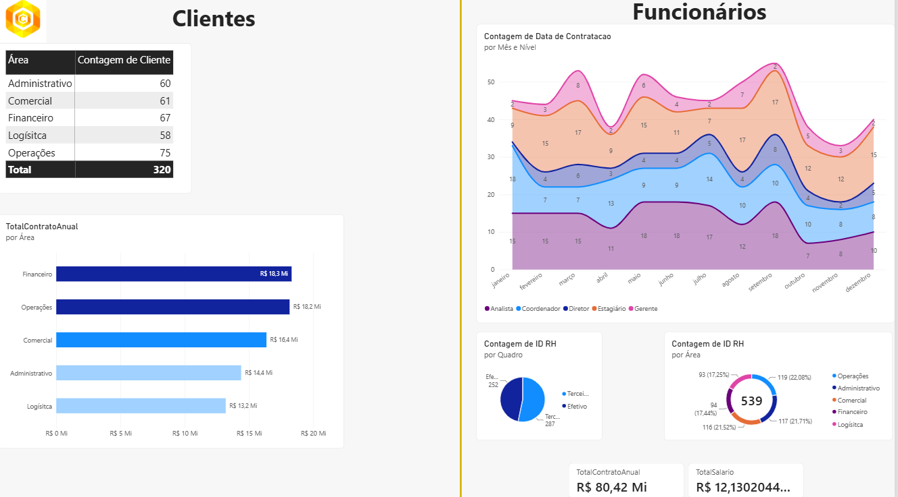
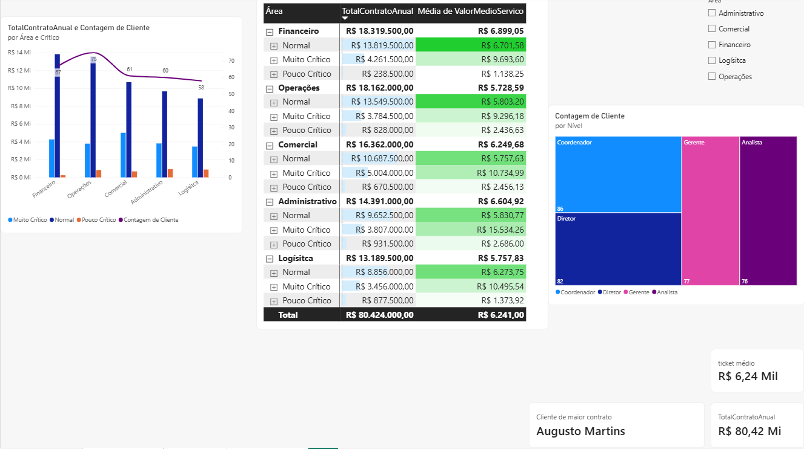
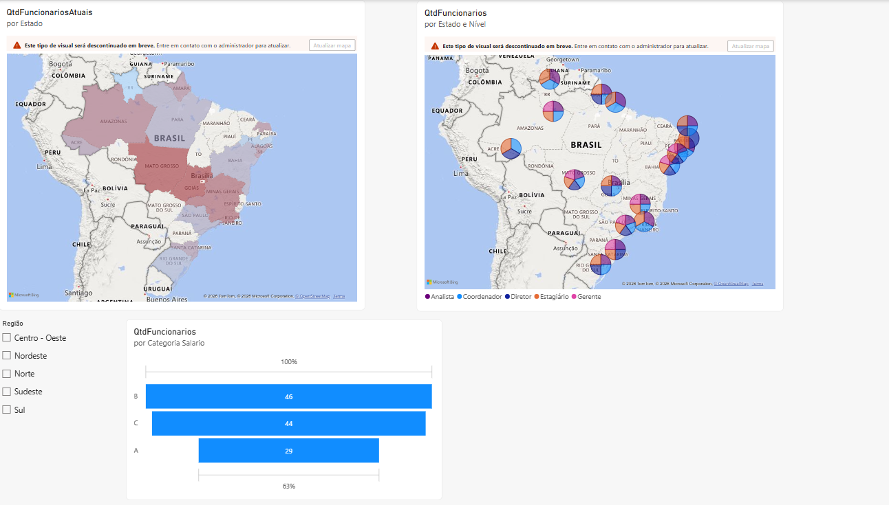

# Estudos em Power BI — Caderno de Anotações

Caderno contínuo de anotações e estudos práticos baseado no curso de Power BI do instrutor João Paulo de Lira na Udemy.

---

## Objetivo
Registrar o aprendizado e a construção de projetos próprios ao longo do curso, cobrindo desde a ingestão e tratamento de dados no Power Query até a modelagem relacional, fórmulas DAX e criação de relatórios visuais.

---

## Estrutura de Pastas

* **[01_preparacao_dados/](./01_preparacao_dados/)**: Modelos e arquivos de teste de ETL, importação e tratamento de consultas. <!-- seção 1 a 5 do curso -->
* **[02_modelagem_dax/](./02_modelagem_dax/)**: Arquivos de relações, modelos relacionais e medidas/fórmulas DAX. <!-- seção 6 a 9 do curso -->
* **[03_visualizacao_dashboard/](./03_visualizacao_dashboard/)**: Relatórios finais autorais (`.pbix`/`.pbit`) e capturas de tela dos dashboards. <!-- seção 10 a 13 do curso -->

---

## Parte 1: Preparação e Tratamento de Dados
- **Anotações:**
  - Fluxo pra importar dados: Obter Dados -> escolher de onde vem os dados -> conectar -> carregar/editar dados (abre o power query pra edição dos dados). 
  - Na edição: olhar cabeçalhos, apagar colunas inúteis, editar formatação de colunas, limpar linhas em branco e/ou linhas duplicadas, etc. 'Transformar dados pra reeditar tabelas'
  - Power Query: ferramenta ETL embutida no Power BI, criada para conectar, limpar, organizar e preparar dados de forma automatizada
  - Ao salvar um arquivo em .pbix, voce está salvando os dashboards realizados, as edições (etapas), sendo que as edições não são aplicadas no arquivo original (o arquivo que voce usou como base de dados). Nunca mova o arquivo base de dados sem mudar a referencia do power bi, senão ele perde de onde puxar os dados.

  - Formatação de colunas ('Transformar' vs. 'Adicionar coluna'): escolha entre alterar a própria coluna ou criar uma nova (recomendado para datas e estatísticas para não perder a informação original). Permite tratar textos (substituir valores, extrair ou dividir por delimitadores), números (operações matemáticas, arredondamentos e estatísticas — obs.: formatação de moeda não aparece no Power Query) e datas (opções para dia, semana, mês, ano e cálculo de idade).
  - Colunas condicionais: Criam-se colunas com base em condições de outras colunas (Categorizar salários por exemplo), intuitivo e análogo a um if/else do python

  - Função 'Agrupar por', presente em 'Transformar' é funcionalmente igual ao GROUP BY do SQL, agrupa pela coluna selecionada
  - Função 'Mesclar Consultas' ou 'merge', presente em 'Página Inicial', é funcionalmente igual aos JOINs do SQL, combinando tabelas com base em colunas em comum
    - Interna ➔ `INNER JOIN` (apenas correspondências em ambas as tabelas)
    - Externa esquerda ➔ `LEFT JOIN` (tudo da 1ª tabela + correspondências da 2ª)
    - Externa direita ➔ `RIGHT JOIN` (tudo da 2ª tabela + correspondências da 1ª)
    - Externa completa ➔ `FULL JOIN` (todas as linhas de ambas as tabelas)
    - Anti esquerda ➔ `LEFT JOIN ... WHERE chave_direita IS NULL` (apenas registros exclusivos da 1ª)
    - Anti direita ➔ `RIGHT JOIN ... WHERE chave_esquerda IS NULL` (apenas registros exclusivos da 2ª)
  - Função 'Acrescentar consultas' ou 'append', serve pra juntar as linhas de duas tabelas que possuem as mesmas colunas (nome). Caso alguma das tabelas possua colunas que não estão na outra, essas colunas serão jogadas pro final da tabela.

## Parte 2: Modelagem e DAX
- **Anotações:**
  - Existe um 'padrão profissional' para criar uma tabela de datas usando essa linha: "= List.Dates(#date(1900,1,1), Number.From(DateTime.LocalNow())- Number.From(#date(1900,1,1)) ,#duration(1,0,0,0))". Ela cria uma tabela com todos os dias desde 01/01/1900. A partir daí, com formatação, voce pode adicionar colunas com as informações que julgar necessário.

  - Para criar relações, na modelagem entre tabelas do Power BI, usa-se o princípio de modelagem lógica de dados, com as mesmas ideias de Chaves Primárias, Estrangeiras e Cardinalidade (Exemplo: Funcionários.DataDeNascimento(FK)  (*)----(1) Calendário.Datas(PK)).
  - Qual intuito de criar relações ? porque elas são importantes ?
    - As ferramentas visuais do BI utilizam a base de dados e as relações para funcionar, então elas são indispensáveis para criar dashboards mais dinâmicos e completos. As relações permitem que seleções de uma tabela consigam filtrar os dados das outras tabelas. Elas também evitam criar uma tabela única enorme, o que aumenta a performance.
  - Tabelas Fato (f_): Registram os acontecimentos/eventos e métricas numéricas para cálculo (Ex: fVendas, fPedidos, fFolhaPagamento).
  - Tabelas Dimensão (d_): Registram o contexto e características para filtrar ou agrupar os dados nos visuais (Ex: dClientes, dFuncionários, dCargos, dCalendário).
  - Linhas e Colunas em matrizes: puxe do lado 1 da relação (de onde sai a seta do relacionamento).
  - É possível relacionar o mesmo par de tabelas uma ou mais vezes, sendo necessário definir qual é a relação ativa.

  - O que são fórmulas DAX ? Fórmulas do Power BI utilizadas sobre os dados das bases. As principais formas de se usar o DAX são:
    - Coluna calculada: Cria uma nova coluna física linha a linha dentro de uma tabela já existente. O cálculo é feito uma única vez durante a carga/atualização dos dados.
    - Medidas: Cálculos dinâmicos calculados "na hora". O valor muda dinamicamente dependendo dos filtros ou fatiadores que o usuário clicar no dashboard.
    - Tabelas calculadas: Uma tabela inteira nova gerada via código DAX, seja criada do zero ou derivada de tabelas existentes.

  - No DAX:
    - podemos somar usando a sintaxe Tabela1[Coluna1] + Tabela1[Coluna2], usando +, -, *, /, ^ mesmo (espécie de coluna calculada)
    - operadores de comparação: >, <, <>, =, >=, <=
    - bool (true/false): ao fazer comparações no DAX (ex: Tabela[Coluna] > 10), o resultado já gera direto true ou false nas linhas, sem precisar de IF
    - operadores especiais em dax
      - &: Concatenação, Nome & Sobrenome - Nome & " " & Sobrenome
      - &&: AND lógico -> 2 condições (1 e 1): DiasFolgas = horasextras > 8 && diasuteistrabalhados >= 200
      - ||: OR lógico -> 1 ou outro (0 e 1, 1 e 0, 1 e 1)
      - IN: operador de pertencimento, checar se um dado pertence a um conjunto
    - Principais formulas do DAX
      - FUNÇÃO IF (condição logica, resultado verdadeiro, resultado falso), podendo aninhá-los ou usar o SWITCH(TRUE())
      - Formulas de texto: LEFT(caracteres da esquerda), RIGHT(caracteres da direita), MID(da posição escolhida pra frente)
      - Formulas de data: YEAR(extrai o ano da data), podemos usar as características: .[Tempo], DATEDIFF, TODAY(), EOMONTH, DATEADD
      - Função Related: Funciona como um JOIN do SQL. Estando na tabela Fato (lado Muitos '*'), ela busca e traz o valor de uma coluna da tabela Dimensão (lado Um '1') aproveitando a relação entre as chaves.

  - Em relação ao DAX pra criar medidas(métricas): medidas são como 'resumos' de uma coluna de uma informação, nas matrizes elas entram, geralmente, como valores.
    - Funções básicas de DAX pra medidas: SUM(soma valores de uma coluna), COUNT(conta numeros), COUNTA(conta numeros e texto), COUNTROWS(conta linhas), DISTINCTCOUNT(conta distintos), CALCULATE(calcula métrica mas com filtro desejado), ALL(apagador de filtros do DAX, usa-se com o CALCULATE), FILTER(usado quando o filtro do CALCULATE é uma medida, pois o CALCULATE sozinho não aceita métricas no filtro)
    - Funções Iterativas: SUMX(faz o cálculo linha a linha antes de somar tudo, como se fosse um SUM para mais de 1 coluna), AVERAGEX(analogo ao SUMX mas pra média), MAXX(pro máximo)
       

---

## Parte 3: Visualização, KPIs e Publicação
- **Anotações:**
  - O power BI disponibiliza diversos componentes visuais para ser utilizado na concepção do dashboard
    - Gráficos de colunas e barras: Barras/Colunas empilhados (tudo em uma Barra/Coluna só), Barras/Colunas clusterizados (divide as informações em colunas seoaradas), Barras/Colunas 100% empilhados (mostra o percentual)
    - Gráficos de linhas, áreas e temporais: Linhas (ideal para acompanhar tendências e evolução contínua ao longo do tempo), Áreas (preenche o espaço abaixo da linha para destacar volume/magnitude), Áreas empilhadas (mostra a proporção de cada categoria e o total acumulado no tempo)
    - Gráficos combinados (Linha e colunas): Ideais para cruzar métricas de grandezas ou escalas diferentes usando um eixo secundário (ex: volume de faturamento em colunas e percentual de margem de lucro na linha)
  - Painel de Filtros e níveis de atuação: serve pra filtrar dados sem precisar criar um fatiador visual na tela, funcionando em 3 níveis:
    - Filtros neste visual: afeta apenas o gráfico/tabela selecionado. Útil pra isolar uma regra específica só nele sem mexer no resto da tela.
    - Filtros nesta página: afeta todos os visuais da aba atual. Se trocar de página, o filtro não se aplica nas outras.
    - Filtros em todas as páginas (relatório inteiro): afeta o dashboard completo, todas as abas. Qualquer página criada vai respeitar essa regra (ótimo pra fixar um ano, uma filial ou ignorar dados inválidos no relatório todo).
  - Formatação condicional: altera cores e visuais dinamicamente com base em regras (ex: vermelho se < meta, verde se >= meta). No Power BI atual fica em "Elementos da célula": ícones, barras de dados, cor de fundo.
  - Matrizes, é possível transformar em tabelas dinâmicas: basta colocar mais valores em 'linhas', o POWER BI faz isso automaticamente
  - Segmentação de Dados: funciona igual aos filtros e seus níveis, mas de uma forma muito mais visual
  - Cartão, Cartão de várias linhas e Caixa de texto: o Cartão destaca um único KPI/número grande (ex: faturamento total); o Cartão de várias linhas agrupa múltiplos indicadores ou categorias em um bloco só; e a Caixa de texto serve pra títulos, cabeçalhos e textos explicativos do dashboard.
  - Gráficos de pizza, anel e treemap: Pizza e Anel mostram a proporção de cada fatia em relação ao todo (bom pra poucas categorias, no máx 4 ou 5 pra não poluir); o Treemap organiza em blocos retangulares proporcionais e com hierarquia, sendo a melhor alternativa pra substituir pizza/anel quando há muitas categorias.
  - Mapas (Comum e Preenchido/Coroplético): o Mapa comum plota bolhas nos pontos geográficos (tamanho da bolha = métrica); o Mapa Preenchido pinta as fronteiras/áreas inteiras dos estados ou países. Dica: sempre defina a 'Categoria de dados' da coluna (País, Estado, Cidade) pras coordenadas do Bing Maps não plotarem no lugar errado.
  - Inteligência de Tempo: fórmulas DAX pra comparações temporais (exige a `dCalendario` contínua); principais: `SAMEPERIODLASTYEAR` (compara com o mesmo período do ano passado), `DATEADD` (volta ou avança períodos: dia, mês, ano) e `TOTALYTD` (acumulado do ano).
  - Função DATEADD: `DATEADD(dCalendario[Datas], quantidade, intervalo)` — usada dentro do `CALCULATE` pra deslocar períodos no tempo (ex: `-1, MONTH` volta 1 mês; `-1, YEAR` volta 1 ano; intervalos válidos: `DAY`, `MONTH`, `QUARTER`, `YEAR`).
  - Visual de KPI: compara um indicador atual contra uma meta ao longo do tempo (usa Valor, Meta e Eixo de tendência). Pinta automaticamente de verde/vermelho se bateu ou não a meta e mostra a evolução gráfica ao fundo.
--- 

## Dashboards Concluídos

### Dashboard de Clientes e Funcionários
* **Arquivo:** [RelatorioFuncionarios.pbix](./03_visualizacao_dashboard/RelatorioFuncionarios.pbix)
* **Resumo:** Dashboard com 3 telas feito pra praticar os visuais, DAX e relacionamentos do curso.

#### 1. Visão Geral
Junta o resumo de clientes e funcionários na mesma tela: contratos por área, contratações no ano em gráfico de área, divisão de funcionários e cartões com faturamento e salários.

#### 2. Clientes
Foco nos contratos: gráfico de colunas com linha pra ver clientes, matriz com formatação condicional (barras de dados e cores), treemap por cargo e cartões de ticket médio e maior contrato.

#### 3. Funcionários
Foco na parte de RH: mapa preenchido por estado, mapa de bolhas com divisão por cargos, filtro de região e gráfico de funil com faixas de salário.

